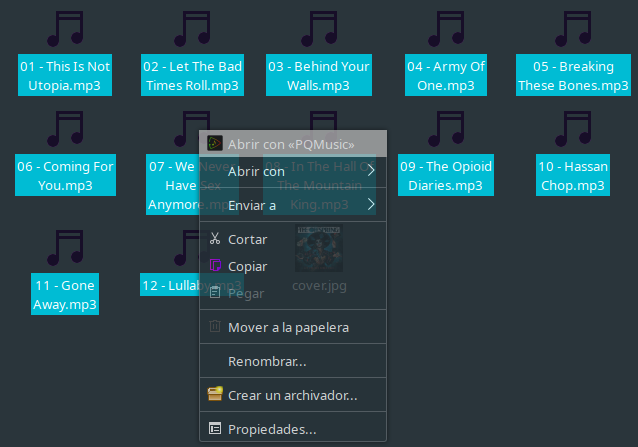

# PQMusic

[https://github.com/son-link/PQMusic](https://github.com/son-link/PQMusic)

PQMusic is a minimalist and easy to use audio player for download and use.

You can play your local files, from a direct url or streaming (for example a online radio) and import/export playlists on M3U format.

Adding files from Open with on your file manager

Drag and drop files to PQMusic's window:

<video controls style="max-width: 720px">
  <source src="pqmusic-drag-drop.mp4" />
</video>

Only available for Linux.

Licensed under GNU/GPL3 or higher.

**Note**: this project is still under development, so some features are not yet available or complete.

## Install

### From source code:

* Clone the repo, download the zip under Code -> Download ZIP or download the last release.
* Open a terminal and go to the project folder.
* Install the dependencies:
  * **From PIP** (with administration permissions): `pip install -r requirements.txt`
  * **Debian/Ubuntu/Mint/MX Linux**:
    * apt: `apt install python3-pyqt5 python3-pyqt5.qtmultimedia libqt5multimedia5 libqt5multimedia5-plugins qtgstreamer-plugins-qt5 python3-mutagen python3-magic dbus-python`
  * **Arch Linux/Manjaro**:
    * pacman: `python-pip python-mutagen python-pyqt5 qt5-multimedia python-mutagen python-magic dbus-python`

  * Copy the icon and desktop file:
    * All users:
      * `install -m 644 bin/io.sonlink.pqmusic.desktop /usr/share/applications`
  	  * `install -m 644 bin/io.sonlink.pqmusic.svg /usr/share/icons/pqmusic.svg`
  	* Current user:
  	  * `cp bin/io.sonlink.pqmusic.desktop ~/.local/share/applications`
  	  * `cp bin/io.sonlink.pqmusic.svg ~/.icons/pqmusic.svg`

### From Pypi:

`pip install PQMusic`

### AUR:

If you use Arch Linux, Manjaro, or other Arch Linux base distributions, you can install yhe official package from [AUR](https://aur.archlinux.org/packages/pqmusic)

For example: `yay -S pqmusic`

### Executables:

You can download a **AppImage** for **GNU/Linux** on [releases page](https://github.com/son-link/PQMusic/releases)

### Command line options:

* `--custom-theme`: Use the application's theme instead of using the environment or default Qt theme
* `-f | --files <files and/or dirs>`: Add files and/or directories for direct playback at startup

### Shortcuts:

* Ctrl+O: Add files
* Ctrl+D: Add dir
* Ctrl+U: Add URL
* Ctrl+P: Open playlist
* Ctrl+C: Open config dialog
* Ctrl+Q: Quit

## Other credits:

* Lüv icons theme: https://github.com/Nitrux/luv-icon-theme

* Open Sans font: https://fonts.google.com/specimen/Open+Sans

* [QssStylesheetEditor](https://github.com/hustlei/QssStylesheetEditor) for make the app theme

* Musical note use in the app icon: https://openclipart.org/detail/110599/musical-note-2-dennis-b-01r
